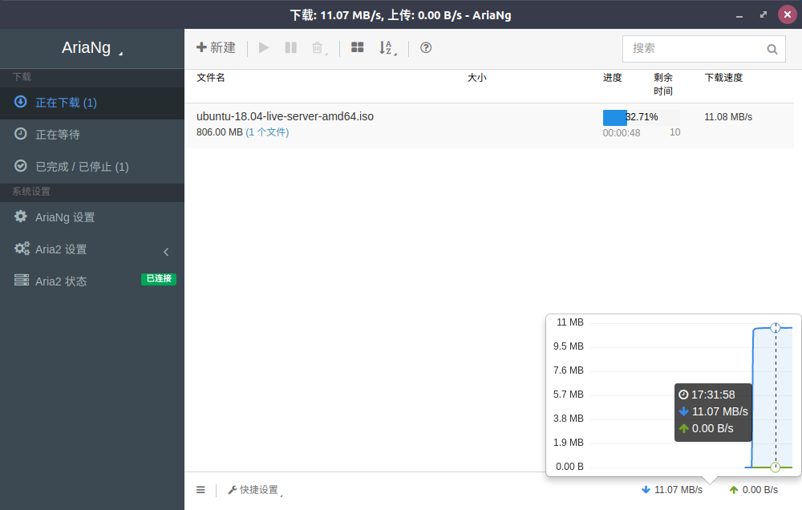
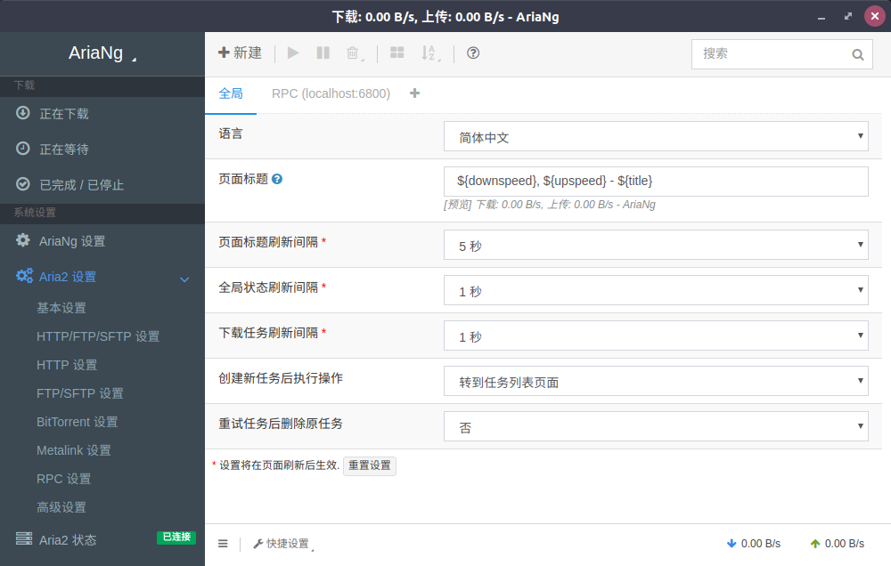

# AriaNg 客户端

> 一个 Aria2 图形界面客户端


## 特性
* 集成aria2c (默认aria2 RPC:`http://localhost:6800`)
* 多线程下载
* 未完成任务退出自动保存
* 支持PT/BT
* 下载完成消息通知
* 多语言支持
* 支持配置多个 aria2 RPC
* 支持直接从远程aria2服务器上下载文件
* 使用响应式布局, 支持各种计算机或移动设备
* 友好的界面交互
    * 任务排序 (按文件名, 文件大小, 进度, 剩余时间, 下载速度等.), 文件排序, 连接节点排序
    * 任务搜索
    * 拖拽调整下载顺序
    * 更详细的任务信息 (健康度, 连接节点客户端信息等.)
    * 根据文件类型过滤任务中的文件 (按视频, 音频, 图片, 文档, 应用程序, 存档文件等.)
    * 全局以及单任务的上传/下载速度图表
    * 完整支持 aria2 设置选项

## 使用

解压后双击`aria-ng.exe`或`aria-ng`(Linux版) 即可

默认下载到与`aria-ng.exe`或`aria-ng`(Linux版) 同一文件夹下的 `Download` 文件夹

## 高级使用

### 文件直接下载

`AriaNg 客户端`支持直接从远程aria2服务器上下载文件，此功能默认关闭。

#### 启用方法：

修改`GUI/resources/app/pages/js/`文件夹下的`download-url-setting.js`文件，将`false`修改为`true`,并在引号内写上直接下载地址。

例如：
```js
// 是否启用文件直接下载
enable_file_download = true

// 请在这里写下您的文件直接下载地址
download_url = "https://www.example.com/"
```

## 截图





## 下载

[Linux版](https://coding.net/u/xmader/p/aria-ng/git/archive/master)

[Windows版](https://coding.net/u/xmader/p/aria-ng/git/archive/windows)

## 特别感谢

* [Aria2](https://aria2.github.io/)
* [AriaNg](http://ariang.mayswind.net/zh_Hans/)
* [Electron](https://electronjs.org/)
* [docsify](https://docsify.js.org/#/zh-cn/)

<!-- ## 作者

[Xmader.com & 超猫](https://www.xmader.com) -->

