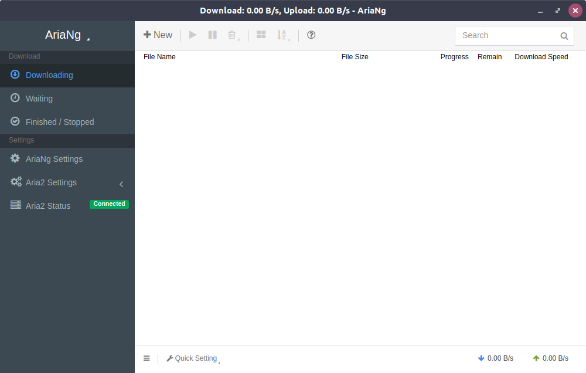
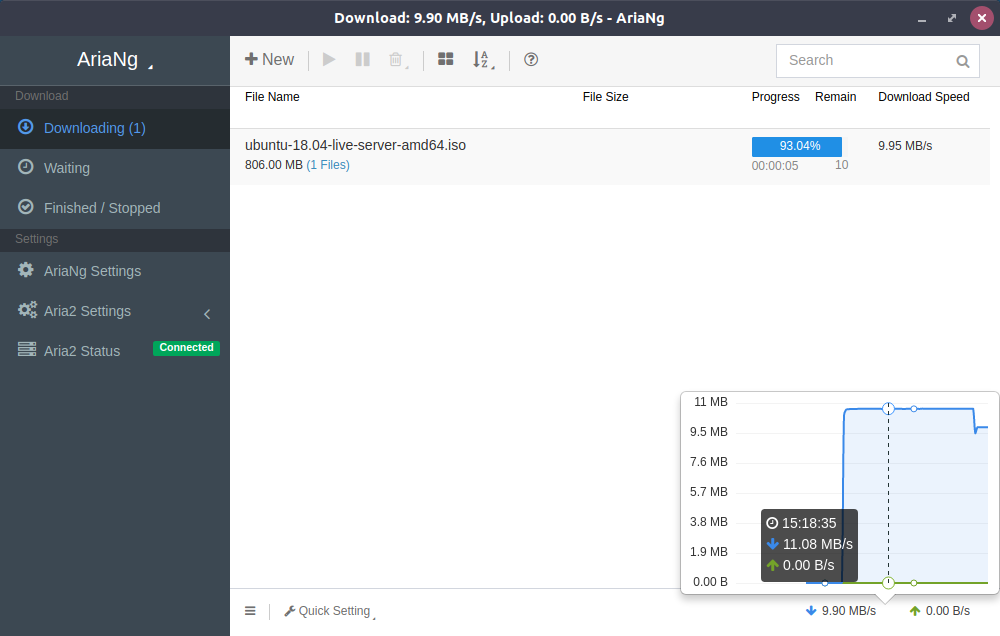
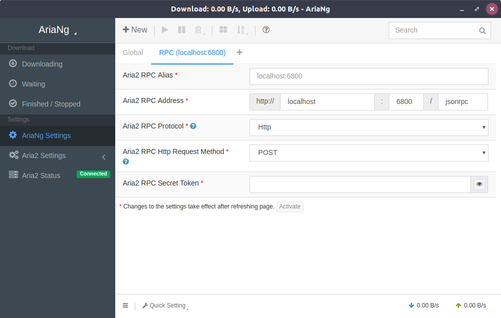
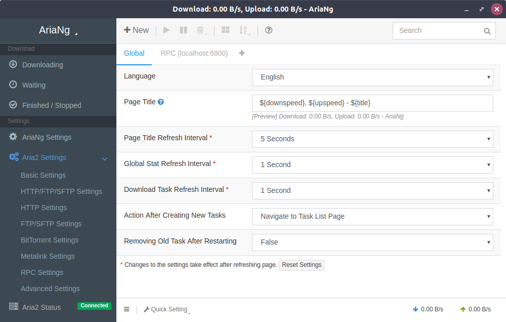

# AriaNg GUI

> An Aria2 GUI for Windows & Linux

## Features
* Integrate aria2c (Default aria2 RPC: `http://localhost:6800`)
* Multi-Thread Download
* Auto save unfinished tasks on exit
* PT/BT support
* Download finished notification
* Multi-languages support
* Multi aria2 RPC host support
* Support for opening download folder, and displaying downloaded files in file manager (the built-in Aria2 RPC only)
* Responsive design, supporting desktop and mobile devices
* User-friendly interface
    * Sort tasks (by name, size, progress, remain time, download speed, etc.), files, peers
    * Search tasks
    * Adjust download order by dragging task
    * More information of tasks (health percentage, client infomation of bt peers, etc.)
    * Filter files of tasks in file types (by videos, audios, pictures, documents, applications, archives, etc.)
    * Download/upload history chart of global or task
    * Full support of aria2 settings

## Usage

Just Unzip it, and Run.

By default, `AriaNg GUI` downloads files into user's `Download` directory.

## Screenshots

## Download

[Releases](https://github.com/Xmader/aria-ng-gui/releases/latest)

## With special thanks to

* [Aria2](https://aria2.github.io/)
* [AriaNg](http://ariang.mayswind.net/)
* [Electron](https://electronjs.org/)
* [docsify](https://docsify.js.org)

